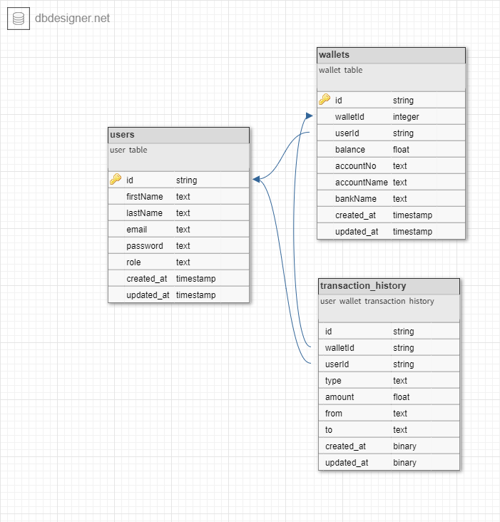

# RemoLoans

Remoloans is a mobile lending app that requires wallet functionality. This is needed as borrowers need a wallet to receive the loans they have been granted and also send the money for repayments.


 
## Features

- A user can create an account
- A user can fund their account
- A user can transfer funds to another user’s account
- A user can withdraw funds from their account.

## Tech Stack

- NodeJS (LTS version)
- KnexJS ORM
- MySQL database
- Typescript

## Other Tools

- Postman for documentation
- Ngrok for webhook testing
- Paystack Payment Gateway


## API Endpoints

```
users: /api/v1/users
auth: /api/v1/auth
wallet: /api/v1/wallet
transaction history: /api/v1/transactions
```


## E-R Diagram



## Points To Note

- Users must have provided their bank account details to make withdrawals from their wallet.
- On funding wallet, a Paystack payment link is sent to user.

## Clone this project

```
git clone https://github.com/mr-chidex/democredit.git
```

```
cd democredit
```

## Configure the app

- Create a file named `.env` in the project root directory
- Add the environment variables as described in the `dev.env` file

## Install dependencies

```
yarn install
```

## Running this project locally

```
yarn dev
```
